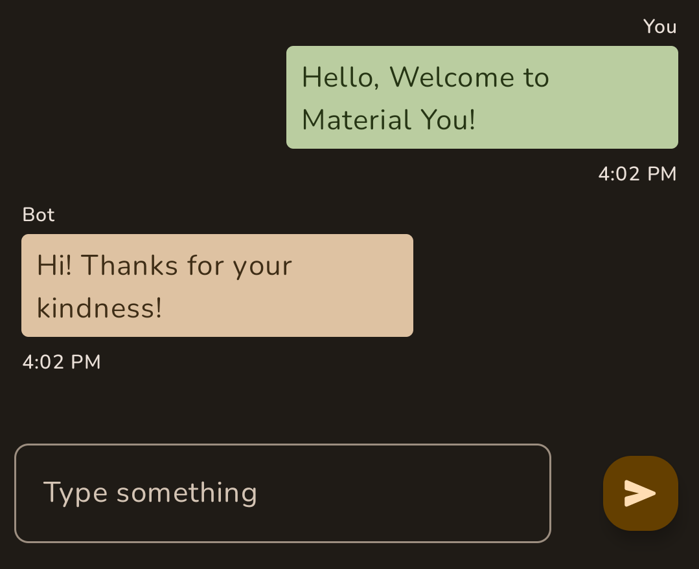
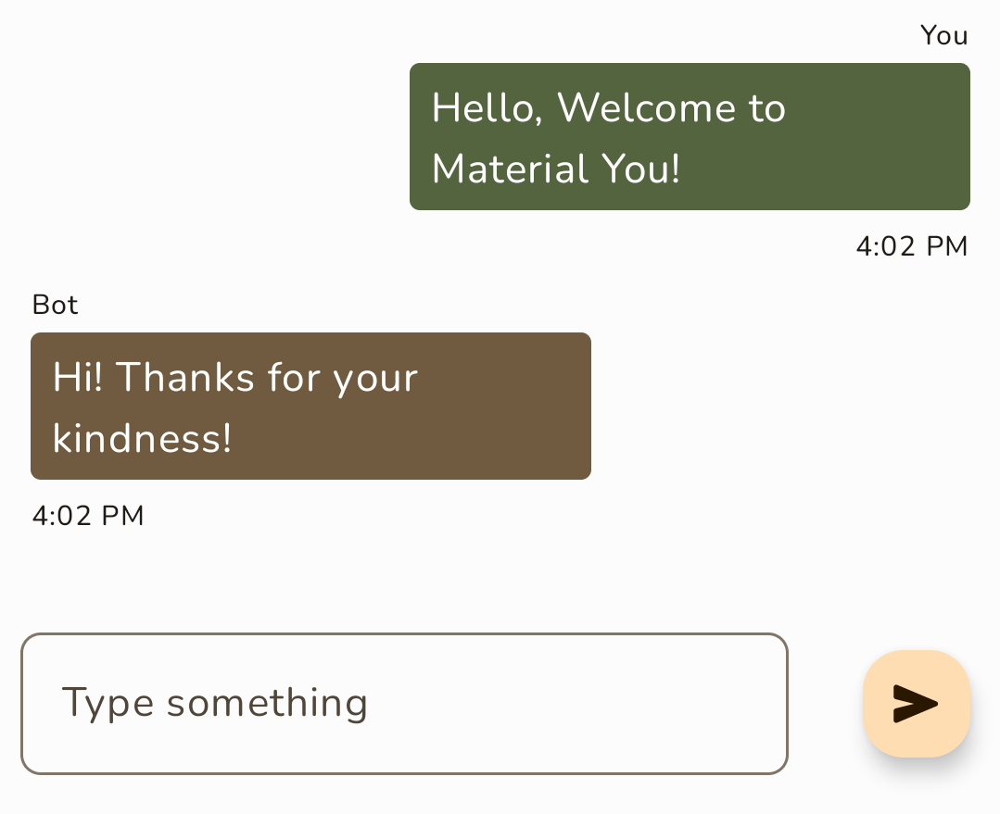
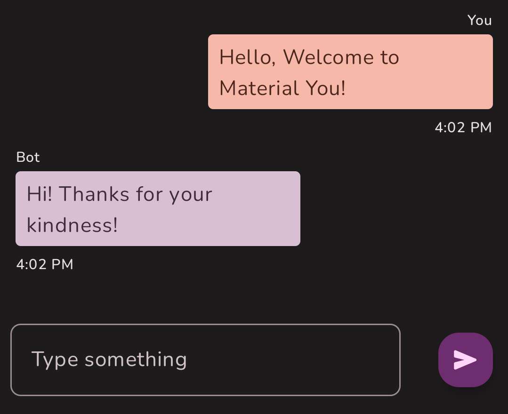
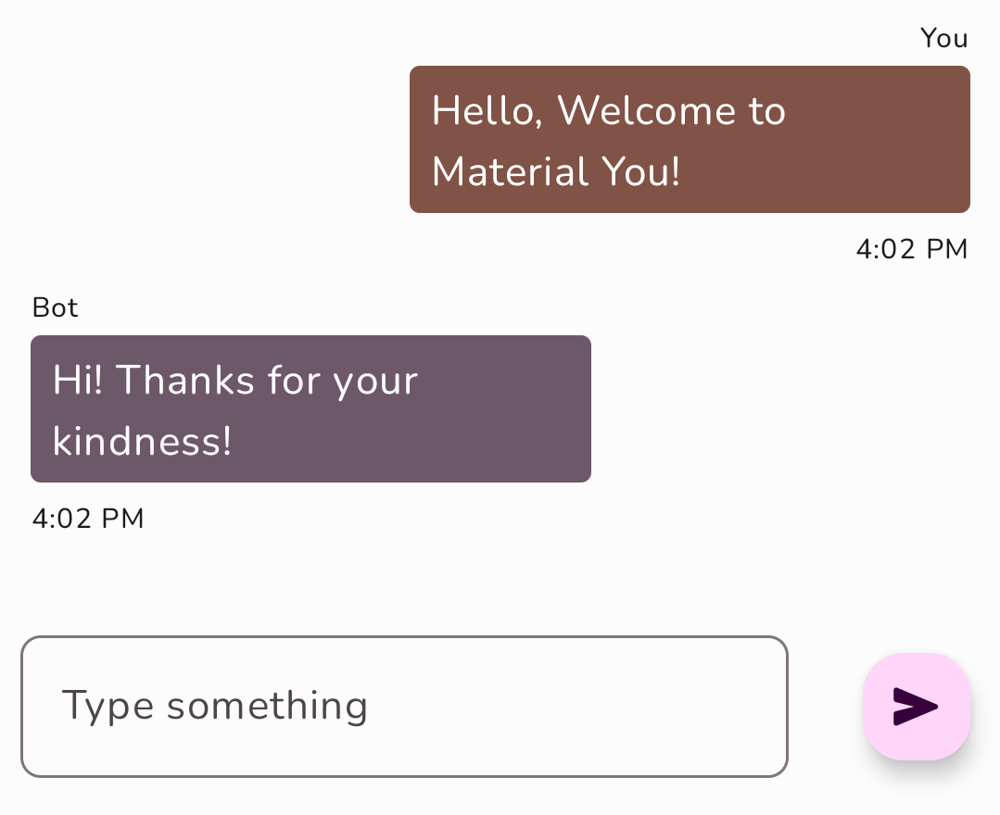
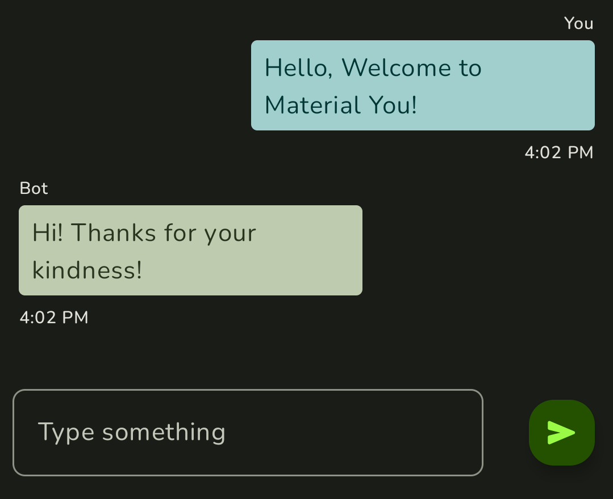
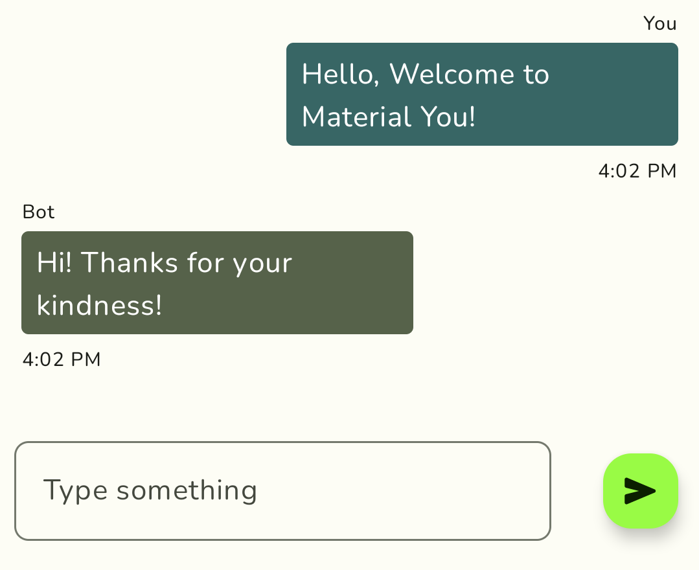

# JiChat 🤖
A Bot-based Android chat app that showcases the implementation of Material You in Android.

## Theme Samples (generated by [Material Theme Builder](https://material-foundation.github.io/material-theme-builder/#/custom))

<table>
  <tr> <td> ⚫ Dark Mode </td> <td> ⚪ Light Mode </td> </tr>
  <tr> <td> </td> <td> </td> </tr>
  <tr> <td> </td> <td> </td> </tr>
  <tr> <td> </td> <td> </td> </tr>
</table>

# Work in progress ⚙️ ⚒️
